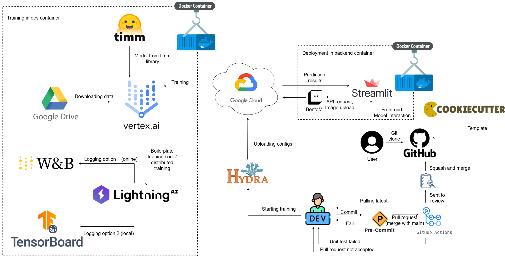

# oracle_mnist

A short description of the project.

## Project structure

MLOPS_ORACLE_MNIST
├── .devcontainer/
│   ├── backend/
│   │   └── devcontainer.json
│   ├── training/
│       └── devcontainer.json
├── .github/
│   ├── workflows/
│   │   └── tests.yaml
│   └── dependabot.yaml
├── configs/
│   ├── .gitkeep
│   ├── config_foo.yaml
│   ├── config.yaml
│   └── sweep_config.yaml
├── data/
│   ├── processed/
│   └── raw/
│   └── .gitignore
├── dockerfiles/
│   ├── backend-dev.dockerfile
│   ├── backend.dockerfile
│   ├── dev.dockerfile
│   ├── frontend.dockerfile
│   └── train.dockerfile
├── docs/
│   ├── images/
│   ├── source/
│   ├── mkdocs.yaml
│   └── README.md
├── models/
├── notebooks/
├── outputs/
├── profiling/
│   ├── profile_output.prof
│   └── profiler.ipynb
├── reports/
│   ├── figures/
│   ├── .gitkeep
│   └── README.md
├── src/
│   ├── oracle_mnist/
│       ├── modules/
│       │   └── train_module.py
│       ├── scheduler/
│       │   └── sarphiv_scheduler.py
│       ├── utils/
│       │   ├── api_utils.py
│       │   ├── data_utils.py
│       │   ├── __init__.py
│       │   └── train_sweep.py
│       ├── api.py
│       ├── data.py
│       ├── evaluate.py
│       ├── frontend.py
│       ├── train_profile.py
│       ├── train.py
│       └── visualize.py
├── tests/
│   ├── integrationtests/
|   |   |── test.api.py
│   └── unittests/
│       ├── test_data.py
│       └── test_model.py
├── .gitignore
├── .pre-commit-config.yaml
├── cloudbuild.yaml
├── LICENSE
├── pyproject.toml
├── README.md
├── requirements.txt
├── requirements_backend.txt
├── requirements_dev.txt
├── requirements_frontend.txt
└── tasks.py

Created using [mlops_template](https://github.com/SkafteNicki/mlops_template),
a [cookiecutter template](https://github.com/cookiecutter/cookiecutter) for getting
started with Machine Learning Operations (MLOps).


# Project Description
### Goal
This is the project description for Group 19 in the 02476 Machine Learning Operations course at DTU. The goal of this project is to create a complete pipeline, from raw hieroglyph data to classified images, using the tools provided during the course.

### Framework
The TIMM framework appears to be the optimal choice for this project. Specifically, we plan to use an image classification framework, along with models such as ResNet18, MobileNetV3, and a custom-made convolutional neural network.

### Data
We have chosen to work with a raw hieroglyph dataset consisting of 30,222 ancient labeled characters from 10 categories of images in various sizes and colors. There is also a preprocessed version of the dataset, where the images have been converted to grayscale, negated, resized, and extended.

### Models
We plan to use several pre-trained CNN models for image classification. We are likely to experiment with different models available in the TIMM framework.


# Installation

This repository uses Conda to manage the virtual environment. If you are not using Conda, you most manually install the requirements in the ``requirements.txt`` file.

To install using Conda, make sure that ``invoke`` is installed in the ``base``-environment. If not, please run:
```
pip install invoke
```

We recommend running the repository from inside a Docker container.
With ``invoke`` installed, just run
```
invoke docker_build
```

# Logging with Weights and Biases
To set up logging with weights and biases, weights and biases needs to be enables in the config.
When enabled, insert an API key in a ``.env`` file. 
The file should then have the following structure
```
WANDB_API_KEY=<your-api-key>
```
It is also possible to login through the terminal, in the case where a API key is not configured.


# MLOps Architecture


